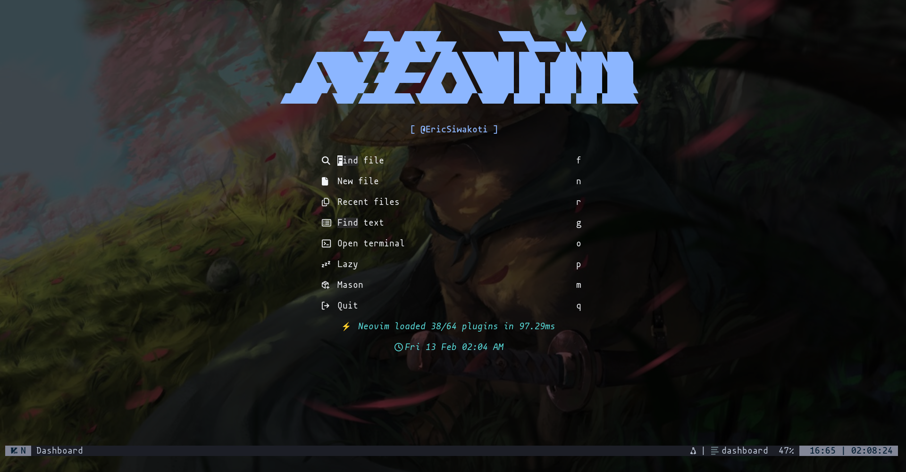
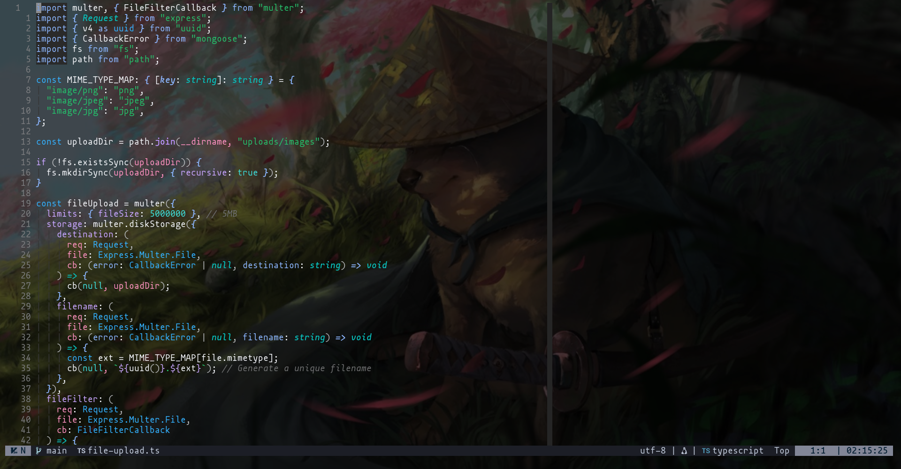
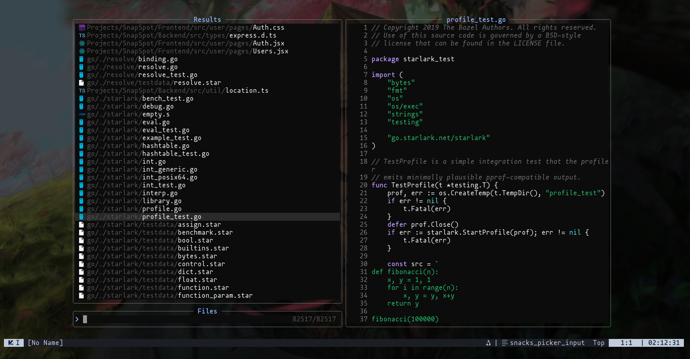
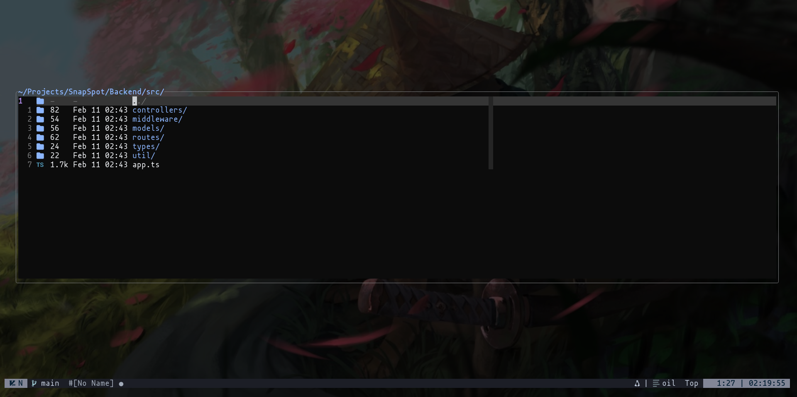
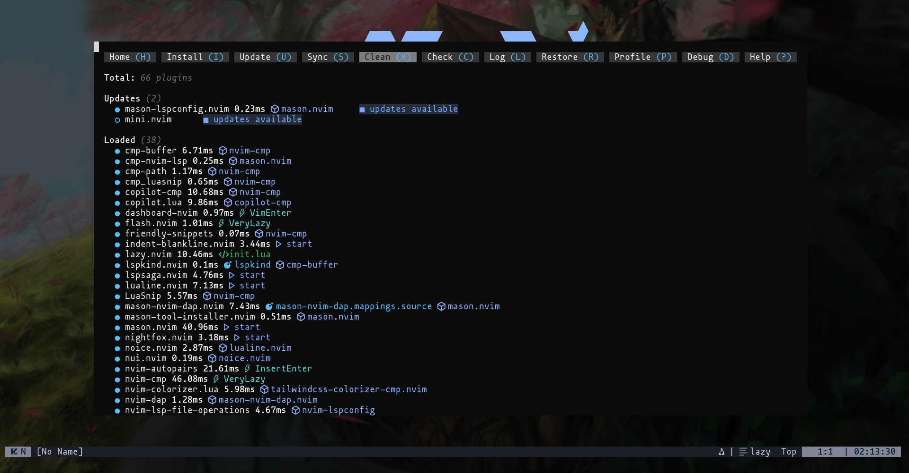
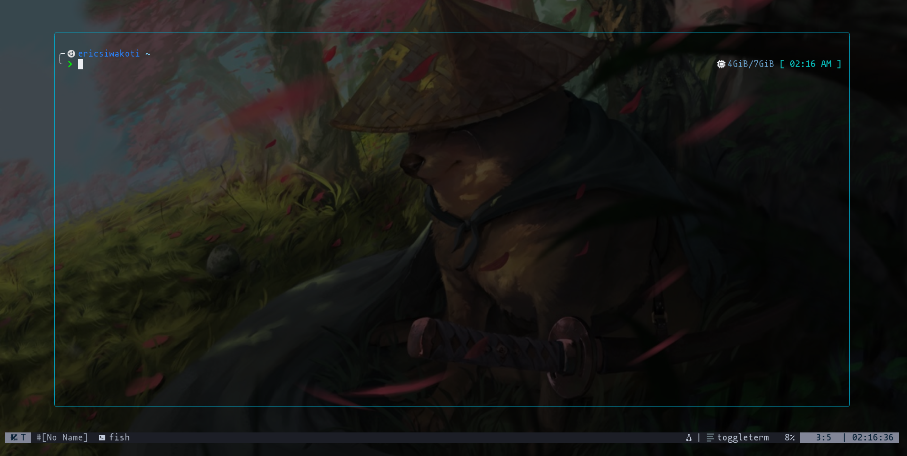

<p align="center">
  
</p>
<h1 align="center">Eric's Neovim Configuration</h1>

<p align="center">
  
  
  
  
</p>

<p align="center">
  A modular, performance-optimized Neovim configuration built on <strong>lazy.nvim</strong> with transparent Carbonfox theming, complete LSP/DAP support, and AI-powered development workflows.
</p>

---

## ✨ Features

- **⚡ Fast startup** — Lazy-loaded plugins with aggressive event/cmd deferral
- **🔧 Full LSP ecosystem** — Mason-managed servers (Go, Rust, TypeScript, Lua, Tailwind, etc.) with lspconfig + Lspsaga UI
- **🤖 AI integration** — GitHub Copilot completions + CodeCompanion chat (GitHub Copilot/Google Gemini)
- **🐛 DAP debugging** — Go (delve), Rust (codelldb), JavaScript/TypeScript (js-debug-adapter) with virtual text + UI
- **🎯 Modern navigation** — Flash.nvim motions, Harpoon2 marks, Oil file manager, Snacks picker
- **📝 Smart editing** — nvim-cmp (LSP + Copilot + snippets), nvim-autopairs, mini.surround, Treesitter
- **🎨 Transparent Carbonfox theme** — Custom lualine statusline, incline floating statusline
- **📦 Git workflow** — Fugitive, Gitsigns, LazyGit, vim-illuminate reference highlighting
- **🔍 Enhanced search** — nvim-bqf (better quickfix), flash.nvim jumps, todo-comments
- **🪟 UI enhancements** — Noice (command-line UI), dashboard (randomized ASCII headers), which-key hints
- **🐚 Integrated terminal** — ToggleTerm with fish shell, LazyGit binding
- **🎮 Discord presence** — cord.nvim with Neovim activity tracking

---

## 📸 Screenshots

### Dashboard

<p align="center">
  
</p>

### Code Editing with LSP

<p align="center">
  
</p>

### File Navigation & Fuzzy Finding

<p align="center">
  
</p>

### Oil File Manager

<p align="center">
  
</p>

### Plugin Manager (Lazy.nvim)

<p align="center">
  
</p>

### Terminal Integration

<p align="center">
  
</p>

---

## 📁 Structure

```
~/.config/nvim/
├── init.lua                    # Bootstrap: shell (fish), undo dir, shada clear → loads config/
├── lua/
│   ├── config/
│   │   ├── init.lua            # lazy.nvim bootstrap + plugin loader
│   │   ├── options.lua         # Editor settings (tabs, search, folds, UI)
│   │   ├── keymaps.lua         # Global keybindings (leader = Space)
│   │   ├── autocmds.lua        # Autocommands (trim whitespace, yank highlight, etc.)
│   │   └── plugin-status.lua   # Central plugin enable/disable registry
│   ├── plugins/
│   │   ├── lsp/
│   │   │   ├── lspconfig.lua   # LSP server configs (gopls, rust_analyzer, ts_ls, lua_ls, etc.)
│   │   │   └── mason.lua       # Mason auto-install for LSP servers + tools
│   │   ├── nvim-cmp.lua        # Completion engine
│   │   ├── nvim-dap.lua        # Debug adapters (Go, Rust, JS/TS)
│   │   ├── snacks.lua          # Picker, explorer, zen mode, notifications, dashboard
│   │   ├── treesitter.lua      # Syntax highlighting + autotag + incremental selection
│   │   ├── conform.lua         # Formatter (prettier, stylua, goimports, etc.)
│   │   ├── git-stuff.lua       # Fugitive, Gitsigns, LazyGit, illuminate
│   │   ├── lspsaga.lua         # LSP UI (code actions, hover, finder, outline)
│   │   ├── flash.lua           # Jump navigation
│   │   ├── harpoon.lua         # File mark navigation
│   │   ├── oil.lua             # File manager
│   │   ├── noice.lua           # Command-line UI overhaul
│   │   ├── whichkey.lua        # Keymap hints
│   │   ├── copilot.lua         # GitHub Copilot
│   │   ├── copilot-cmp.lua     # Copilot completion source
│   │   ├── codecompanion.lua   # AI chat assistant
│   │   └── ...                 # 30+ additional plugin configs
│   └── util/
│       ├── keymapper.lua       # Keymap helper utilities
│       ├── lsp.lua             # LSP on_attach with Lspsaga keybindings
│       └── autoheaders.lua     # Randomized dashboard ASCII art
```

---

## ⌨️ Keybindings

> **Leader key:** `Space`

### Navigation & Files

| Key          | Action                     |
| ------------ | -------------------------- |
| `<leader>pf` | Find files (Snacks picker) |
| `<leader>ps` | Grep search (Snacks)       |
| `<leader>pc` | Find Neovim config files   |
| `<leader>pw` | Grep word under cursor     |
| `<leader>o`  | Open Oil file manager      |
| `<leader>-`  | Oil floating window        |
| `<leader>ee` | Mini file explorer         |
| `<leader>es` | Snacks explorer            |
| `s`          | Flash jump (2-char)        |
| `S`          | Flash Treesitter select    |

### Harpoon (File Marks)

| Key         | Action              |
| ----------- | ------------------- |
| `<leader>a` | Add file to harpoon |
| `<C-e>`     | Toggle harpoon menu |
| `<C-y>`     | Jump to mark 1      |
| `<M-i>`     | Jump to mark 2      |
| `<C-n>`     | Jump to mark 3      |
| `<M-s>`     | Jump to mark 4      |

### LSP (via Lspsaga)

| Key          | Action                     |
| ------------ | -------------------------- |
| `K`          | Hover documentation        |
| `<leader>gd` | Peek definition            |
| `<leader>gD` | Go to definition           |
| `<leader>gt` | Peek type definition       |
| `<leader>ca` | Code action                |
| `<leader>rn` | Rename symbol              |
| `<leader>fd` | Find references (Lspsaga)  |
| `<leader>lD` | Show line diagnostics      |
| `<leader>ld` | Show cursor diagnostics    |
| `<leader>cf` | Format file (conform.nvim) |
| `<leader>lo` | Toggle outline             |
| `]d` / `[d`  | Next/prev diagnostic       |

### Git

| Key          | Action                 |
| ------------ | ---------------------- |
| `<leader>gg` | Fugitive status (`:G`) |
| `<leader>lg` | LazyGit TUI            |
| `<leader>gs` | Stage hunk             |
| `<leader>gr` | Reset hunk             |
| `<leader>gp` | Preview hunk           |
| `<leader>gS` | Stage buffer           |
| `<leader>gR` | Reset buffer           |
| `<leader>gB` | Toggle line blame      |
| `<leader>gb` | Blame current line     |
| `]h` / `[h`  | Next/prev hunk         |

### Debug (DAP)

| Key          | Action                 |
| ------------ | ---------------------- |
| `<F5>`       | Continue               |
| `<F10>`      | Step over              |
| `<F11>`      | Step into              |
| `<F12>`      | Step out               |
| `<leader>db` | Toggle breakpoint      |
| `<leader>dB` | Conditional breakpoint |
| `<leader>dl` | Log point              |
| `<leader>dr` | Toggle REPL            |
| `<leader>dt` | Terminate              |
| `<leader>dc` | Run to cursor          |
| `<leader>du` | Toggle DAP UI          |
| `<leader>de` | Evaluate expression    |

### AI (CodeCompanion)

| Key          | Action                        |
| ------------ | ----------------------------- |
| `<leader>cc` | Toggle CodeCompanion chat     |
| `<leader>ca` | Add visual selection to chat  |
| `ga`         | Add visual selection (visual) |

### General

| Key                         | Action                        |
| --------------------------- | ----------------------------- |
| `<leader>sv` / `<leader>sh` | Vertical/horizontal split     |
| `<M-j>` / `<M-k>`           | Move line down/up             |
| `<leader>zz`                | Zen mode (Snacks)             |
| `<C-\>`                     | Toggle floating terminal      |
| `<leader>s`                 | Replace word under cursor     |
| `<leader>ch`                | Clear command history (shada) |
| `<C-d>` / `<C-u>`           | Scroll down/up (centered)     |
| `n` / `N`                   | Next/prev search (centered)   |
| `<Esc>`                     | Clear search highlight        |

### Which-Key Groups

- `<leader>c` — Code (AI, format, diagnostics)
- `<leader>d` — Debug (DAP)
- `<leader>e` — Explorer
- `<leader>f` — Find (LSP references, diagnostics)
- `<leader>g` — Git
- `<leader>l` — LSP
- `<leader>p` — Picker (files, grep)
- `<leader>s` — Split/Search
- `<leader>t` — Terminal/Trouble

---

## 🚀 Installation

### Prerequisites

- **Neovim** ≥ 0.10
- **Git**
- **Fish shell** (configured in `init.lua`)
- **A Nerd Font** (for icons)
- **ripgrep** (`rg`) — for Snacks picker grep
- **fd** (optional) — faster file finding
- **Node.js** — for LSP servers (ts_ls, tailwindcss, etc.)
- **Go** (optional) — for gopls, delve debugger
- **Rust** (optional) — for rust_analyzer, codelldb debugger

### Setup

```bash
# Back up existing config
mv ~/.config/nvim ~/.config/nvim.bak
mv ~/.local/share/nvim ~/.local/share/nvim.bak

# Clone this config
git clone https://github.com/EricSiwakoti/nvim-config.git ~/.config/nvim

# Launch Neovim — lazy.nvim auto-installs on first run
nvim
```

On first launch:

1. **lazy.nvim** bootstraps itself and installs all plugins
2. **Mason** auto-installs LSP servers from `lua/plugins/lsp/mason.lua`
3. **mason-nvim-dap** installs debug adapters (delve, codelldb, js-debug-adapter)
4. Run `:checkhealth` to verify setup

### Post-Install

```vim
:Lazy          " Plugin manager UI (install, update, clean)
:Mason         " LSP/tool installer UI
:LspInfo       " Active LSP server status
:DapInstall    " Manual DAP adapter install (if needed)
:MasonUpdate   " Update all Mason packages
```

---

## 🎛️ Plugin Management

### Enable/Disable Plugins

Edit `lua/config/plugin-status.lua` to toggle any plugin without removing its config file:

```lua
return {
    -- Core plugins (always enabled)
    ["autopairs"] = true,
    ["nvim-cmp"] = true,
    ["treesitter"] = true,
    ["lspconfig"] = true,
    ["mason"] = true,

    -- Optional plugins (toggle as needed)
    ["git-stuff"] = true,        -- Git integrations
    ["nvim-dap"] = true,          -- Debug adapter
    ["copilot"] = true,           -- GitHub Copilot
    ["codecompanion"] = true,     -- AI chat
    ["incline"] = false,          -- Floating statusline (disabled)
    ["mini"] = true,             -- mini.nvim modules
    ["peek"] = true,              -- Markdown preview
    ["cord"] = true,              -- Discord presence
}
```

After changing `plugin-status.lua`, restart Neovim or run `:Lazy sync`.

---

## 📝 Notes

### Fish Shell Configuration

The config sets `vim.o.shell = "fish"` in `init.lua`. If you don't use fish, change to your shell:

```lua
vim.o.shell = "bash"  -- or "zsh"
```

### Shada (Command History)

Press `<leader>ch` to clear command/search history (deletes `~/.local/share/nvim/shada/main.shada`).

### Undo Persistence

Undo history is stored in `~/.cache/nvim/undodir` (auto-created on first run).

### Transparent Background

Carbonfox theme has transparency enabled in `lua/plugins/nightfox.lua`. Disable by setting `transparent = false`.

---

## 🔧 Customization

### Add a New LSP Server

1. Add to `ensure_installed` in `lua/plugins/lsp/mason.lua`
2. Add config to `servers` table in `lua/plugins/lsp/lspconfig.lua`
3. Restart Neovim or run `:Mason` to install

### Add a New Debug Adapter

1. Add to `ensure_installed` in `lua/plugins/nvim-dap.lua` (mason-nvim-dap spec)
2. Configure `dap.adapters` and `dap.configurations` in the same file
3. Restart Neovim

### Change Theme

Replace `nightfox.nvim` in `lua/plugins/nightfox.lua` with your preferred colorscheme plugin.

---

## 🐛 Troubleshooting

### LSP not attaching

```vim
:LspInfo          " Check if LSP is running
:Mason            " Verify server is installed
:checkhealth lsp  " Diagnose LSP issues
```

### Copilot not working

```vim
:Copilot setup    " First-time setup
:Copilot status   " Check authentication
```

### Debugger not starting

```vim
:DapInstall <adapter>  " Manually install adapter
:checkhealth dap       " Diagnose DAP issues
```

---

<p align="center">
  <sub>Built with ❤️ and Lua</sub>
</p>
